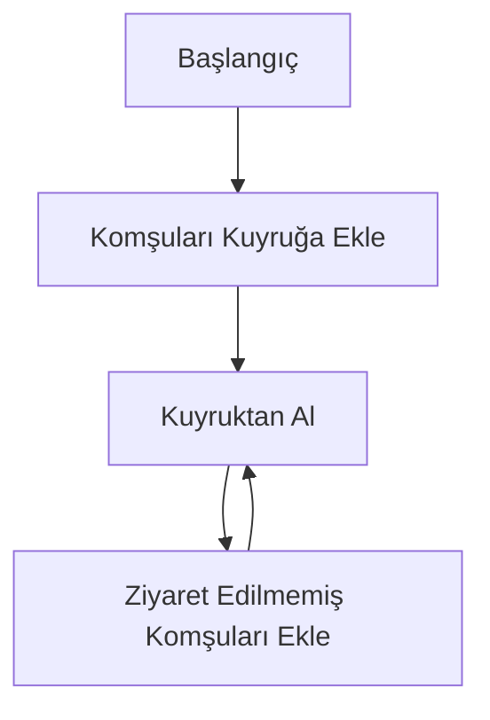
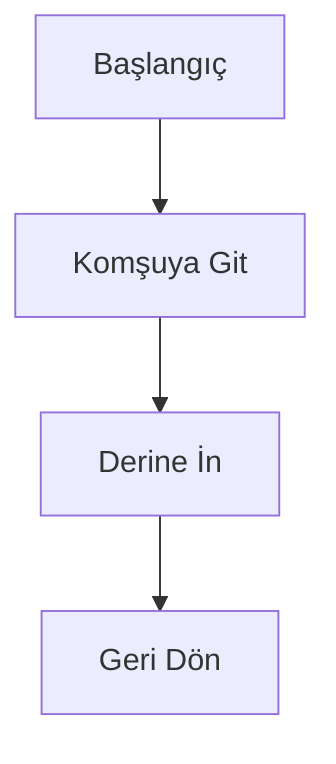
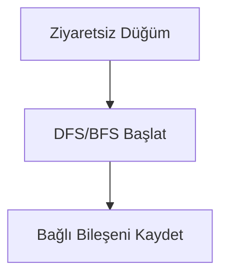
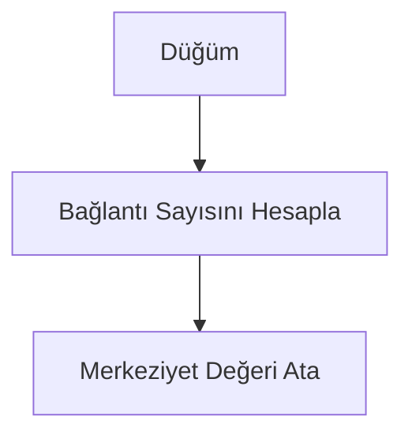
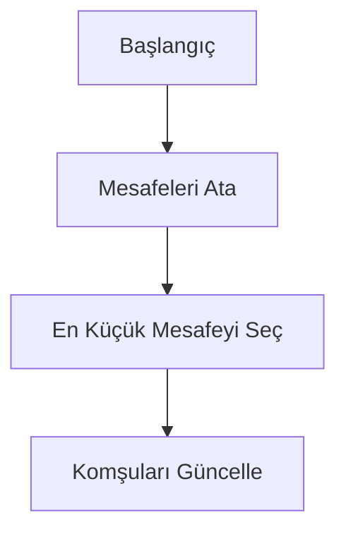
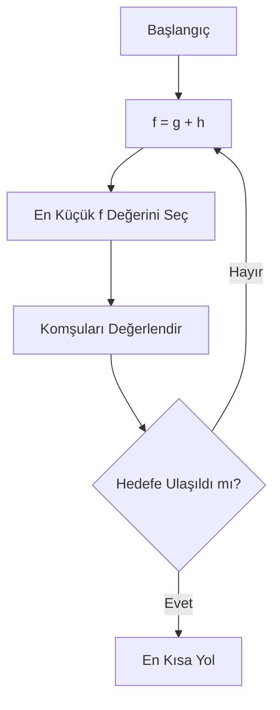
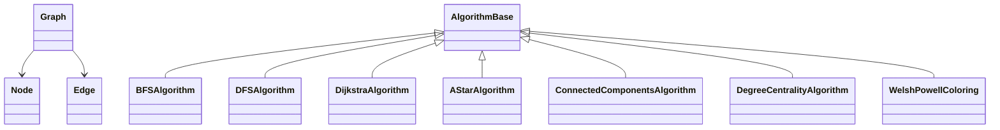

# Social Network Analysis

## 1. Proje Bilgileri
- **Proje Adı:** Social Network Analysis
- **Ekip Üyesi:** Esma Nur Mantı
- **Ekip Üyesi:** Nalan Kara
- **Tarih:** 2026

---

## 2. Giriş (Problem Tanımı ve Amaç)

Sosyal ağlar; bireyler, gruplar veya kurumlar arasındaki ilişkilerin modellenmesi ve analiz edilmesi
amacıyla kullanılan yapılardır. Bu ilişkiler matematiksel olarak grafik (graph) veri yapıları ile
temsil edilmektedir.

Günümüzde sosyal ağların yapısal özelliklerinin analiz edilmesi; toplulukların belirlenmesi,
merkezi bireylerin tespit edilmesi ve ağ üzerindeki etkileşimlerin anlaşılması açısından büyük
önem taşımaktadır.

Bu projede, sosyal ağları temsil eden grafik yapıları üzerinde çeşitli grafik algoritmaları
gerçeklenmiş ve ağın temel yapısal özellikleri analiz edilmiştir.

### Amaçlar
- Sosyal ağları grafik veri yapısı ile modellemek
- Temel grafik algoritmalarını uygulamak
- Topluluk yapıları ve merkezi düğümleri analiz etmek
- Algoritmaların zaman karmaşıklıklarını incelemek

---

## 3. Gerçeklenen Algoritmalar

Bu projede sosyal ağların analiz edilmesi amacıyla farklı kategorilerde grafik algoritmaları
gerçeklenmiştir. Algoritmalar; dolaşım (traversal), en kısa yol, renklendirme ve analiz
başlıkları altında toplanmıştır.

---

### 3.1 Breadth-First Search (BFS)  
📁 `Traversal/BFSAlgorithm.cs`

**Çalışma Mantığı:**  
BFS algoritması, graf üzerinde başlangıç düğümünden itibaren düğümleri seviyeler halinde
dolaşan bir arama algoritmasıdır. Özellikle en kısa yolun kenar sayısı cinsinden bulunmasında
kullanılmaktadır.

**Zaman Karmaşıklığı:**  
- O(V + E)

---

### 3.2 Depth-First Search (DFS)  
📁 `Traversal/DFSAlgorithm.cs`

**Çalışma Mantığı:**  
DFS algoritması, graf üzerinde mümkün olduğunca derine inerek arama yapar. Bağlı bileşenlerin
tespit edilmesinde temel algoritmalardan biridir.

**Zaman Karmaşıklığı:**  
- O(V + E)

---

### 3.3 Connected Components (Bağlı Bileşenler)  
📁 `Analysis`

**Çalışma Mantığı:**  
Bu algoritma, grafik içerisinde birbirinden tamamen kopuk alt grafik yapılarını (bağlı
bileşenleri) tespit etmektedir. Her bağlı bileşen, BFS veya DFS kullanılarak bulunur.

**Zaman Karmaşıklığı:**  
- O(V + E)
---

### 3.4 Degree Centrality (Derece Merkeziyeti)  
📁 `Analysis`

**Çalışma Mantığı:**  
Degree centrality, bir düğümün sahip olduğu bağlantı sayısını temel alarak ağ içerisindeki
önemini ölçmektedir. Sosyal ağ analizlerinde merkezi bireylerin tespitinde kullanılmaktadır.

**Zaman Karmaşıklığı:**  
- O(E)

---

### 3.5 Dijkstra Algoritması  
📁 `ShortestPath/DijkstraAlgorithm.cs`

**Çalışma Mantığı:**  
Dijkstra algoritması, pozitif ağırlıklı grafiklerde tek bir kaynaktan diğer düğümlere olan en
kısa yolların bulunmasını sağlar.

**Zaman Karmaşıklığı:**  
- O((V + E) log V)
---

### 3.6 A* (A-Star) Algoritması  
📁 `ShortestPath/AStarAlgorithm.cs`

**Çalışma Mantığı:**  
A* algoritması, en kısa yol problemini çözmek için Dijkstra algoritmasına ek olarak sezgisel
(heuristic) bir fonksiyon kullanır. Bu sayede hedef düğüme daha hızlı ulaşılması amaçlanır.

**Zaman Karmaşıklığı:**  
- En kötü durumda: O(E)  
- Pratikte heuristic fonksiyona bağlıdır

---

### 3.7 Welsh–Powell Graph Coloring Algoritması  
📁 `Coloring/WelshPowellColoring.cs`

**Çalışma Mantığı:**  
Welsh–Powell algoritması, grafik renklendirme problemi için kullanılan sezgisel bir
yaklaşımdır. Düğümler derece sırasına göre ele alınır ve komşu düğümlerin aynı rengi
almaması sağlanır.

**Zaman Karmaşıklığı:**  
- O(V²)
Algorithm
    class DijkstraAlgorithm

## 4. Sınıf Yapısı ve Modüller

**Açıklama:**  
Uygulama, nesne yönelimli tasarım prensiplerine uygun olarak geliştirilmiştir. Grafik yapısını
oluşturan sınıflar ile algoritmalar birbirinden ayrılmış olup, algoritmalar ortak bir temel
sınıftan türetilmiştir. Bu yapı, sistemin modüler ve genişletilebilir olmasını sağlamaktadır.

---

## 5. Uygulama, Test Senaryoları ve Sonuçlar

### Test Senaryosu
Bu çalışmada tek bir test senaryosu kullanılmıştır. Test senaryosunda,
gerçek bir sosyal ağ yapısını temsil edebilmek amacıyla **sahte (örnek) veriler**
oluşturulmuş ve bu veriler **CSV dosyası** formatında sisteme yüklenmiştir.
Uygulama, yüklenen CSV dosyasını kullanarak grafik yapısını otomatik olarak
oluşturmaktadır.

Oluşturulan veri seti, **kulüp tabanlı bir sosyal ağ yapısını** temsil etmektedir.
Bu yapı içerisinde **kulüp başkanı, kulüp başkan yardımcısı, birim başkanı,
birim üyeleri ve genel üyeler** gibi farklı roller bulunmaktadır. Roller arasındaki
ilişkiler düğümler ve kenarlar aracılığıyla graf yapısına aktarılmıştır.

Test verileri içerisinde üç farklı kulüp yer almaktadır ve bu kulüpler
**birbirleriyle bağlantılı** olacak şekilde modellenmiştir. Oluşturulan topluluk
yapıları aşağıda özetlenmiştir:

- **Community #1:** 20 düğüm, 63 kenar — *Yapay Zeka Kulübü*
- **Community #2:** 26 düğüm, 76 kenar — *Robotik Kulübü*
- **Community #3:** 30 düğüm, 105 kenar — *Veri Bilimi Kulübü*

Bu test senaryosu sayesinde, geliştirilen algoritmaların hem kulüp içi
ilişkilerde hem de kulüpler arası etkileşimlerde doğru ve tutarlı sonuçlar
ürettiği gözlemlenmiştir.

## 5. Uygulama, Test Senaryoları ve Sonuçlar

### 5.1 Breadth-First Search (BFS)

BFS algoritması, kulüp temelli sosyal ağ grafı üzerinde uygulanmıştır.
Algoritma, bir kulüp üyesinden başlayarak diğer üyelere olan bağlantıları
seviye bazlı olarak incelemiştir. Bu sayede bir üyenin, kulüp içerisindeki
diğer üyelere kaç adımda ulaştığı gözlemlenebilmiştir.

Her üyenin yalnızca bir kez ziyaret edilmesi, algoritmanın doğru şekilde
çalıştığını göstermektedir. BFS algoritması, özellikle kulüp içi iletişim
ağlarının ve hiyerarşik yapıların analiz edilmesi için uygun bir yöntem
olduğunu ortaya koymaktadır.

---

### 5.2 Depth-First Search (DFS)

DFS algoritması, kulüp yapısı içerisinde derinlik öncelikli dolaşım
gerçekleştirmek amacıyla kullanılmıştır. Algoritma, bir üyeden başlayarak
önce aynı birim veya alt gruptaki üyeleri derinlemesine incelemiştir.

Bu yaklaşım sayesinde kulüp içindeki alt gruplar ve bireyler arasındaki
dolaylı ilişkiler gözlemlenebilmiştir. DFS algoritması, kulüp yapısının
detaylı olarak keşfedilmesi ve bağlı alt yapıların analiz edilmesi açısından
etkili bir yöntem olarak değerlendirilmiştir.

---

### 5.3 Dijkstra Algoritması

Dijkstra algoritması, kulüp üyeleri arasındaki **en kısa iletişim yolunun**
belirlenmesi amacıyla uygulanmıştır. Algoritma, bir üyenin başka bir üyeye
en az kaç bağlantı üzerinden ulaşabileceğini hesaplamıştır.

Elde edilen sonuçlar, özellikle kulüp başkanı, birim başkanı ve aktif üyeler
arasındaki iletişim mesafelerinin analiz edilmesine olanak sağlamıştır.
Dijkstra algoritması, kulüp içi ve kulüpler arası en kısa bağlantı yollarının
belirlenmesinde etkili bir yöntem olduğunu göstermektedir.

---

### 5.4 A* (A-Star) Algoritması

A* algoritması, kulüp üyeleri arasındaki en kısa yolu daha hedef odaklı
bir şekilde bulmak amacıyla uygulanmıştır. Algoritma, sezgisel yaklaşımı
sayesinde hedef üyeye daha hızlı ulaşmayı amaçlamıştır.

Bu sayede, belirli bir kulüp üyesinden başka bir kulüp üyesine olan
iletişim yolu, gereksiz düğümler incelenmeden hesaplanabilmiştir.
A* algoritması, kulüp bazlı sosyal ağlarda hızlı yol analizi için
Dijkstra algoritmasına alternatif bir yöntem olarak değerlendirilmiştir.

---

### 5.5 Welsh–Powell Graph Coloring Algoritması

Welsh–Powell algoritması, kulüp temelli sosyal ağ grafı üzerinde
renklendirme yaparak **kulüplerin ve alt grupların ayrıştırılması**
amacıyla kullanılmıştır. Algoritma, birbiriyle doğrudan bağlantılı
üyelerin aynı renk grubunda yer almamasını sağlamıştır.

Bu sayede kulüpler ve kulüp içerisindeki alt gruplar görsel olarak
ayırt edilebilir hale gelmiştir. Welsh–Powell algoritması, kulüp
yapılarının ve topluluk sınırlarının net bir şekilde ortaya
konulmasında etkili olmuştur.

---

### 5.6 Topluluk (Community) Analizi

Bu çalışmada kulüp temelli sosyal ağ verileri üzerinde topluluk analizi
gerçekleştirilmiştir. Analiz sonucunda ağ yapısı, düğümler arasındaki
bağlantılara göre üç ayrı topluluk olarak ayrılmıştır.

Her topluluk bir kulübü temsil etmekte olup, kulüp içi bağlantıların
kulüpler arası bağlantılara kıyasla daha yoğun olduğu gözlemlenmiştir.
Tespit edilen topluluk yapıları aşağıda özetlenmiştir:

- **Community #1:** 20 düğüm, 63 kenar — Yapay Zeka Kulübü  
- **Community #2:** 26 düğüm, 76 kenar — Robotik Kulübü  
- **Community #3:** 30 düğüm, 105 kenar — Veri Bilimi Kulübü  

Topluluk analizi sonuçları, kulüp başkanı, başkan yardımcısı ve birim
başkanları gibi rollerin topluluk içerisinde daha merkezi bir konumda
yer aldığını ve kulüp yapısının net bir şekilde ayrıştığını
göstermektedir.

### Sonuçlar

- Algoritmalar beklenen çıktıları doğru şekilde üretmiştir
- BFS ve DFS algoritmaları doğrusal zaman karmaşıklığına uygun performans göstermiştir
- Sistem, küçük ve orta ölçekli ağlar için başarılı sonuçlar vermiştir
---

## 6. Sonuç ve Tartışma

### Başarılar
- Grafik algoritmaları kulüp temelli sosyal ağ yapısı üzerinde başarıyla uygulanmıştır.
- Modüler ve okunabilir bir yazılım mimarisi oluşturulmuştur.
- Sosyal ağ analizi için temel dolaşım, en kısa yol ve topluluk analizleri gerçekleştirilmiştir.

### Sınırlılıklar
- Büyük ölçekli veri setleri için performans optimizasyonu yapılmamıştır.
- Gerçek dünya verileri yerine örnek (sahte) veriler kullanılmıştır.

### Olası Geliştirmeler
- Daha büyük ve gerçek sosyal ağ veri setleri ile sistemin test edilmesi.
- Ek merkeziyet ölçütleri ve farklı topluluk tespit algoritmalarının sisteme dahil edilmesi.
- Görsel kullanıcı arayüzünün performans açısından iyileştirilmesi.

---

## Kaynakça

- Dijkstra, E. W. (1959). A note on two problems in connexion with graphs. *Numerische Mathematik*.
- Freeman, L. C. (1979). Centrality in social networks. *Social Networks*.
- Sedgewick, R., & Wayne, K. (2011). *Algorithms*. Addison-Wesley.
